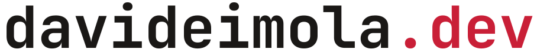

<p align="center">
  <picture>
    <source media="(prefers-color-scheme: dark)" srcset="brand/domain.svg">
    
  </picture>
</p>

Tech Lead at [RedCarbon](https://redcarbon.ai), building AI agents for cybersecurity. Open source builder.

> I believe what you learn must be shared.

- Co-founder of [Schrödinger Hat](https://schroedinger-hat.org) · an open source community of 20k+ people across Europe
- Co-organizer of [Open Source Day](https://osday.dev) · 500+ attendees in Florence, every year

## Currently building

**[Argus](https://github.com/argusappsec/argus)** is an open-source application security agent: it runs real scanners, reasons over their findings with your organization's context, and answers back in plain language. Terminal chat, GitHub pull requests, MCP.

```sh
docker run -it -v argus-data:/data -p 8080:8080 ghcr.io/argusappsec/argus
```

It is early, and that is what it needs: people running it on real code. Try it, then [tell me where it gets things wrong](https://github.com/argusappsec/argus/issues).

## How I work

- **Decisions get written down.** ADRs sit in the repo next to the code they explain, so the reasoning survives the commit.
- **I publish what I learn, including what did not work.** [I Built a Tool I Don't Use](https://davideimola.dev/blog/i-built-a-tool-i-dont-use) is the retrospective of a tool I shipped, was proud of, and never used.
- **Then I go say it out loud.** GoLab, KCD Italy, WeAreDevelopers World Congress, DevSecOps Day, Incontro DevOps Italia.

## Latest writing

<!-- BLOG-POSTS:START -->
- [I Built a Tool I Don't Use](https://davideimola.dev/blog/i-built-a-tool-i-dont-use)
- [Stop Prompting. Start Thinking.](https://davideimola.dev/blog/stop-prompting-start-thinking)
- [I Rebuilt My Site Twice. Here's What the Second Time Taught Me.](https://davideimola.dev/blog/i-rebuilt-my-site-twice)
<!-- BLOG-POSTS:END -->

## Stack

- **Go** is the primary language: production microservices, two GoLab talks.
- **Kubernetes and Flux** are the platform backbone: GitOps, with talks at KCD Italy, DevOps Day and Incontro DevOps.
- **TypeScript and Next.js** for product frontend, and for [davideimola.dev](https://davideimola.dev).
- **DDD, TDD and GitOps** are how all of the above stays maintainable. The tests are not optional.

## Elsewhere

- [davideimola.dev](https://davideimola.dev) for everything I write, build and speak about.
- [A monthly digest](https://davideimola.dev/newsletter) of it, in your inbox.

---

```
❯ whoami
Davide Imola · Tech Lead · Verona, Italy
❯ _
```
